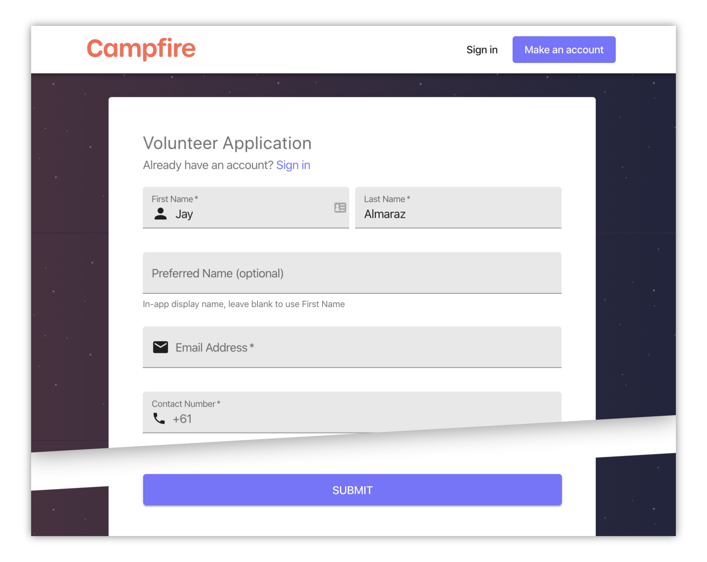
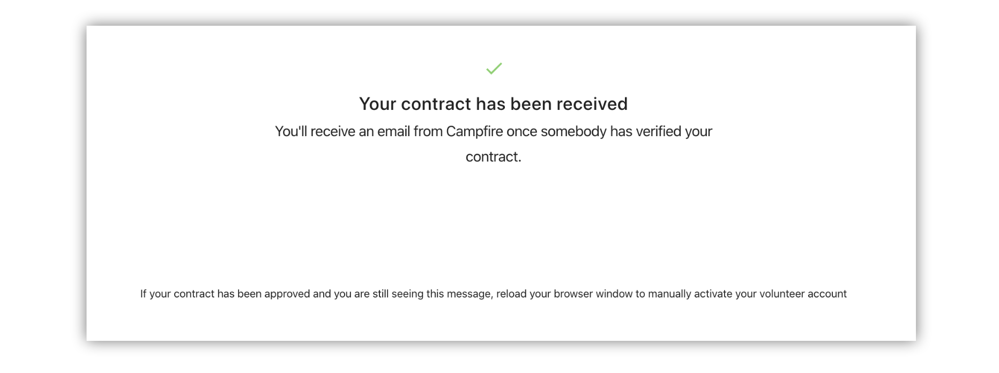

# Signing up to Campfire

Before you begin your volunteering journey on Campfire, you'll need to have a Campfire account. This article outlines the steps to help get you set up.

## Creating your Campfire account

### Application form

The very first step is to complete the application form. The application form contains a basic set of questions. The link to this form will be provided by your organisation.

### Email confirmation

After you have submitted your application form, you'll receive an email from `postman@campfireapp.org`, our Campfire mail server. This email will be either:

1. A confirmation email letting you know your application was received and is awaiting verification, or
2. A welcome email giving your first time sign in details

Once you receive the type `2.` email you're ready to sign in to Campfire and continue with your journey.

### Signing in

The first time you log into Campfire you'll be required to set a password. This is your secure password that will be used to sign in to Campfire from then on.

You can always change your password later. If you forget your password and can't sign in, follow the `Forgot Password?` link on the sign in page and enter your email; you'll receive instructions for resetting your password.

## Required documents (if applicable)

Depending on your organisation’s requirements, you may need to complete some prerequisites to the volunteer contract. Each of these can be filled out individually. Once you're done you'll be able to access the contract form.

## Volunteer contract

Once you have completed your required documents, you will be able to access the volunteer contract. Complete the questions on the page and submit the form.

### Contract verification

After you submit your contract you'll enter one of two pipelines:

1. Your organisation will receive and verify your contract. Once the contract has been approved you will receive an email from `postman@campfireapp.org` letting you know, or
2. If automatic verification is configured and successful, your volunteer account will be activated immediately and you'll be signed over to the volunteering side of Campfire.

> If your contract has been approved but you are still seeing the above message, try manually reloading or refreshing your browser

### Next steps

With your volunteer contract completed you can start your onboarding checklist. See the [guide on applying to join a team](../volunteering/applying-to-join-a-team.md) for more info.
