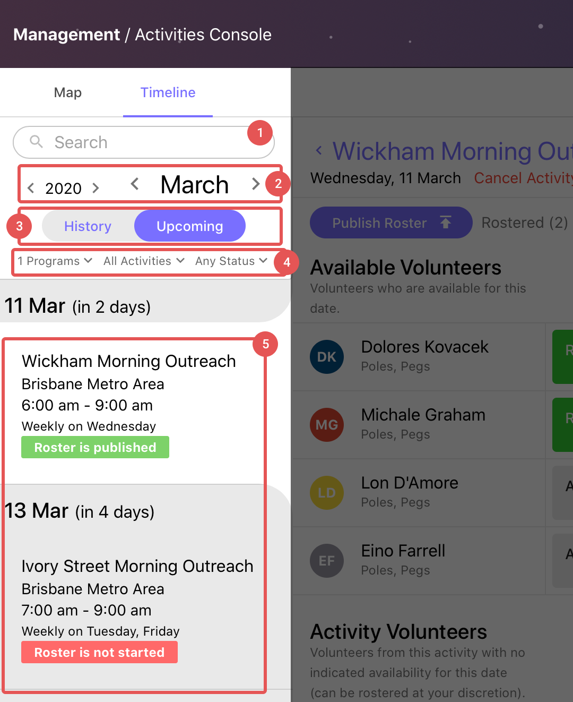

# Introduction to Activities
{: .no_toc }

## Table of contents
{: .no_toc .text-delta }

1. TOC
{:toc}

---

## What are Activities, and why do they exist?
{: .fs-10 }

Activities are our way of connecting volunteers with amazing opportunities. An Activity on Campfire can be anything: a weekly shift, a weekend event, a standalone speaking engagement, or a massive all-day activation.

We have a vision for volunteering that is inclusive of, but also extends far beyond, the regular week-by-week service model that our previous system (Shifts) were bias towards. You have a dedicated, passionate, and diverse pool of volunteers who are all driven by a common desire to do good, and to be a part of something bigger than themselves. With Activities, we are building an ecosystem wherein your vollies can feel more engaged and be even closer to new volunteering opportunities as they arise.

In this article we'll be introducing the fundamentals of Activities, and all of their supporting systems. Let's find out how Activities fit into your operations.

## Changes to Terminology and Pages
{: .fs-10 }

With Activities comes an updated set of terminology. These new names have been chosen to make the systems less tied to shifts, services, and cities. This allows us to continue to build powerful features into Activities without being inconsistent with our choice of words.

### Words that have changed
{: .no_toc }

| Old Word        | New Word        | Meaning |
| --------------- | --------------- | ------- |
| Shift           | Activity        | ...     |
| Shift Report    | Activity Report | ...     |
| City            | Program         | ...     |
| Service Manager | Program Manager | ...     |
| Team Leader     | Activity Leader | ...     |

### Pages that have changed
{: .no_toc }

| Old Page         | New Page         | Why? |
| ---------------- | ---------------- | ---- |
| All Locations    | Explore          | ...  |
| My Shifts        | My Activities    | ...  |
| Shift Report     | Activity Report  | ...  |
| Service Managers | Program Managers | ...  |

### Pages that have been absorbed by Activities Console
{: .no_toc }

| Pre-Activities Console | Meaning |
| ---------------------- | ------- |
| Completed Shifts       | ...     |
| Roster                 | ...     |
| Team Builder           | ...     |
| Shift Management       | ...     |

## Campfire Structure
{: .fs-9 }

It's important to understand the basic structure of Campfire to see how Activities fir into the system. As outlined above, we've made a few changes to terminology as well. The new names and pages will be referenced constantly throughout this guide and the Campfire application.

1. **Organisation** -- Your organisation sits at the very top of your Campfire account. Settings such as your application screening questions, onboarding prerequisite, activity roles, and eventually Report Types all sit at the organisational level.
1. **Program** -- Programs are used to break down your volunteers and activities into manageable pools. Programs might be region based, or structured by the type of operation that they contain, or both! The Program Manager role can be assigned to split the work between your leaders and managers.
1. **Activity** -- The core of Campfire operations, Activities are where volunteers are connected with your mission. Rosters and Reports are all managed through activities; we cover how to use these systems further down the page.
1. **Session** -- Within an Activity there are Sessions. A Session is simply used to distinguish individual units of work. An Activity may have one session, or several.

## Using the Activities Console
{: .fs-10 }

The _Activities Console_ is a massively overhauled interface, which includes all of the functionality that the Completed Shifts, Roster, Team Builder, and Shift Management pages once did. On top of the core functionality, we've reimagined _Activities Console_ to be far more powerful for managing your operations from a single place.

In this section we'll introduce the new interfaces and describe the location of key toolsets. A little further in we will cover where to find and how to use the new Roster and Reporting systems.

### Activity Console Header

The header that is persistent across almost all Activity Console view.

1. **Activities Console Tabs** -- Use these to change views while using the Activities Console. The `Map` view is available on desktop. The `List` view is the mobile equivalent of the map, useful for quickly finding an activity. `Timeline` is a more complex interface, presenting all historic and upcoming Activity dates, allowing you to access any past/present Activity Report or future Roster from a single place.
2. **Management Tools** -- Toolbar for creating/managing Activities and Report Types. As more management tools are added they will appear here (i.e. Program Management `coming soon`).

### Map View
{: .fs-9 }

Activities are presented on the Map, alongside powerful filters which can be used to narrow or widen the scope of the view. This is a near identical reflection of the _Explore_ page.

1. **Search Bar** -- Use this to search for any Activity within the current filters.
2. **Filters** -- Use the filter settings to show more or fewer Activities. You can apply settings to view Activities across multiple programs, or narrow your search down by day, duration, and time.
3. **List** -- The list of Activities returned by the filter and search settings. Click on any activity to open the `Overview` interface.
4. **Map** -- A map view of the listed Activities.

### Timeline View
{: .fs-9 }

The _Timeline_ view is a one-stop shop for all of your Rosters and Reports - past, present, and future. Using the _Directory_, any Activity and date can be located and opened. Any _Upcoming_ Activities opened from the Timeline will be presented through the _Roster_ interface, while Activities from the _History_ list will be opened in the _Report_ view.

Timeline also allows managers to edit past Activity Reports, in case details were entered incorrectly on the original submission or other amendments need to be made. The Report view on an Activity also shows the Roster that was published with that Activity for the given date. History has never been this easy to access.

1. **Search Bar** -- Search for any activity by name.
2. **Date Selection** -- Select a month and year to view within the timeline.
3. **Timeline Switch** -- Switch between viewing past Activity dates (_History_) and future (_Upcoming_) dates.
4. **Filters** -- Filter the timeline by _status_, _Program_, and _Activity_.
5. **List** -- The list of Activities returned by the search, date, and filter settings.

## Rostering with Activities
{: .fs-10 }

Rosters have received a facelift. The same basic breakdown of volunteer pools remains, while the rostering is now done across the activity like a time table. Rosters must still be published for volunteers to be notified, and cancelling a Roster will now notify all volunteers immediately via email.

1. **Activity Name** -- Use this to navigate up to the Overview page for the selected Activity.
2. **Cancel Activity Button** -- Open the Cancel Activity dialog for the selected Activity and date.
3. **Roster Drafting Tools** -- _Save_ or _Discard_ changes as you go, if the roster isn't ready to be published.
4. **Roster Publishing Tools** -- View the final list of rostered volunteers, and _Publish_ the roster when it's ready to go.
5. **Available Volunteers** -- A list of all of the volunteers who have responded to this Activity date, and have indicated an availability for one or more sessions.
6. **Activity Volunteers** -- Volunteers who are enrolled in the selected Activity but have not submitted any availability preferences for the given date.
7. **Unavailable Volunteers** -- Volunteers who have indicated an unavailability for the date selected.
8. **All Volunteers** -- All _other_ volunteers who are in the selected Activity's Program.

## Submitting Activity Reports
{: .fs-10 }

An Activity Report exists as the collection of Session Reports for the given activity and date. Reports can be access either through the _Timeline_ view on the Activities Console (for Program Managers and Activity Leaders) or through the _Activity Report_ page in the Volunteer section of the side bar.

1. **Activity Name** -- Use this to navigate up to the Overview page for the selected Activity.
2. **Cancel Activity Button** -- Use this Cancel feature if the selected Activity was cancelled retrospectively.
3. **Session Report Card** -- There is technically no 'Activity Report' submission, only the accumulation of all of that Activity's Session Reports. These Session Reports can be individually _Omitted_ if they didn't run, or produced no report.
4. **Roster** -- A snapshot of the Published Roster at the time of the Activity running - useful when comparing/editing attendances.

1. **Activity and Date Selection Fields** -- These are used to specify the activity and date to begin creating Session Reports.
2. **Activity Name** -- Use this to deselect the current date and discard any Session Reports that were in progress.
3. **Cancel Activity Button** -- Use this Cancel feature if the selected Activity was cancelled retrospectively.
4. **Session Report Card** -- There is technically no 'Activity Report' submission, only the accumulation of all of that Activity's Session Reports. These Session Reports can be individually _Omitted_ if they didn't run, or produced no report.
