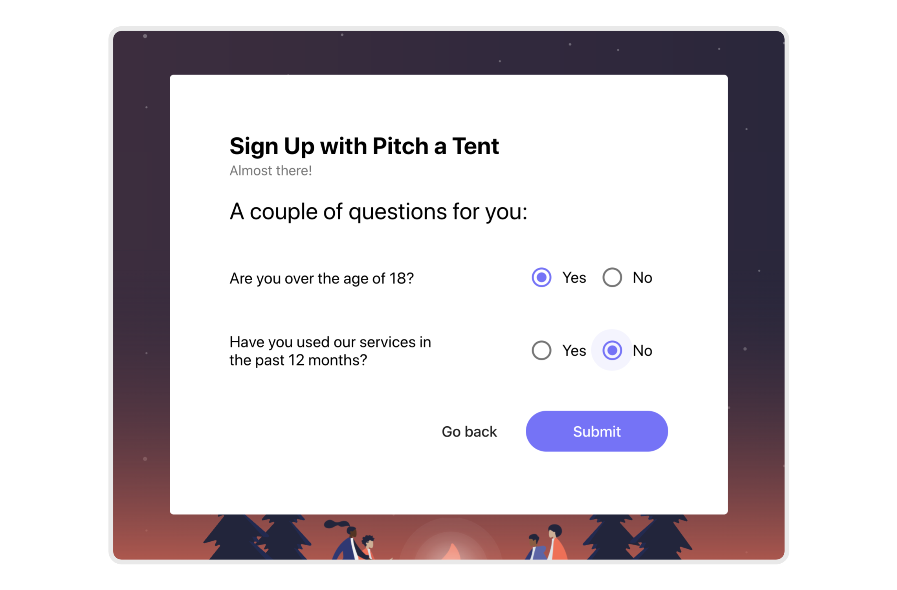
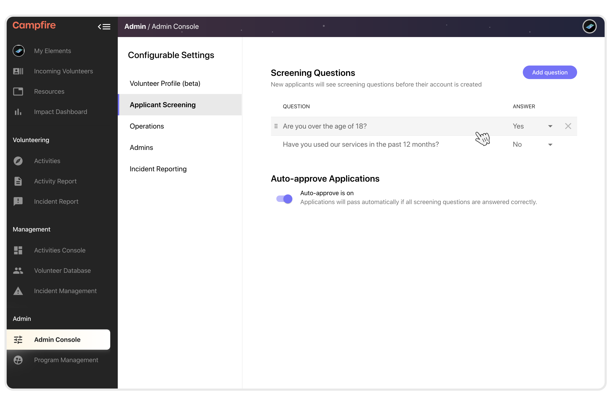
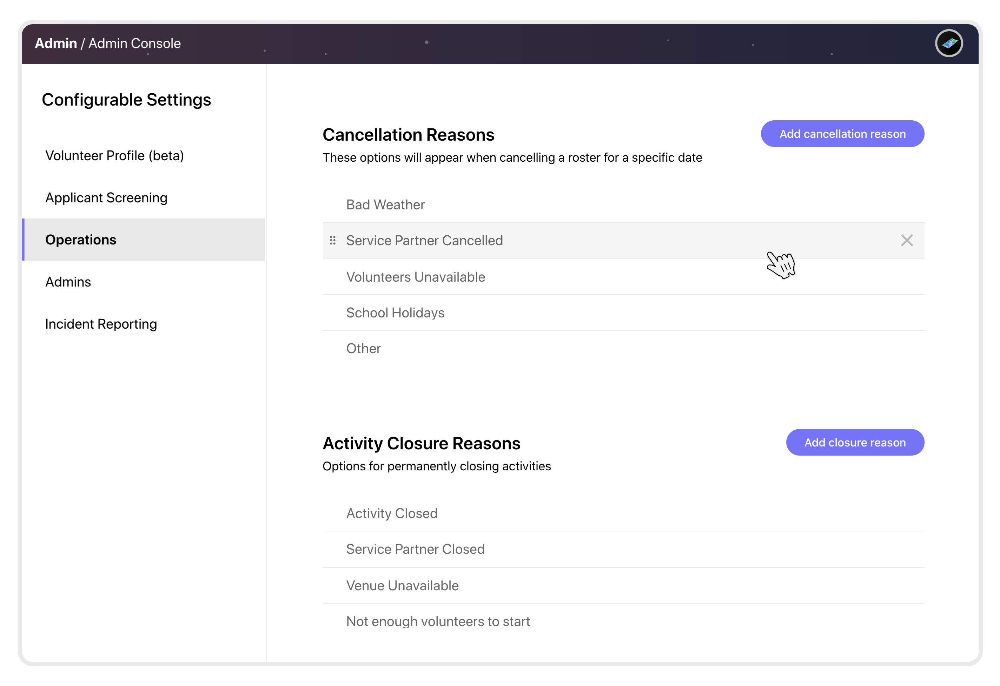
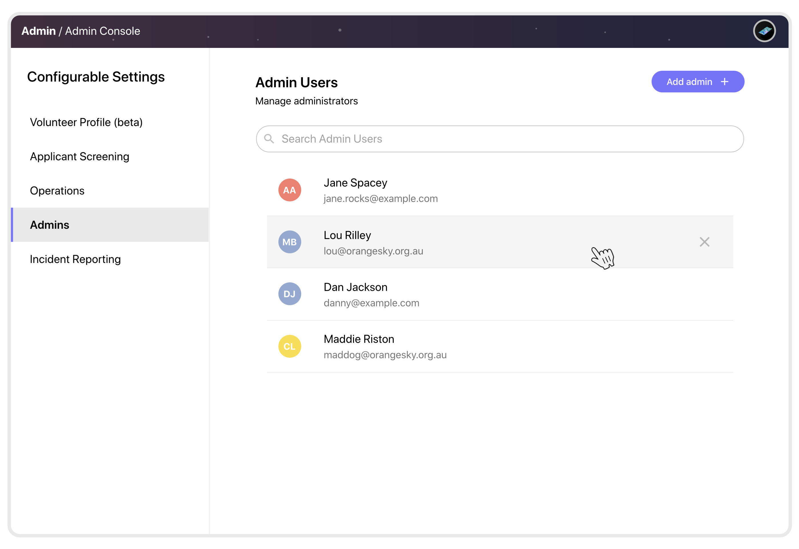
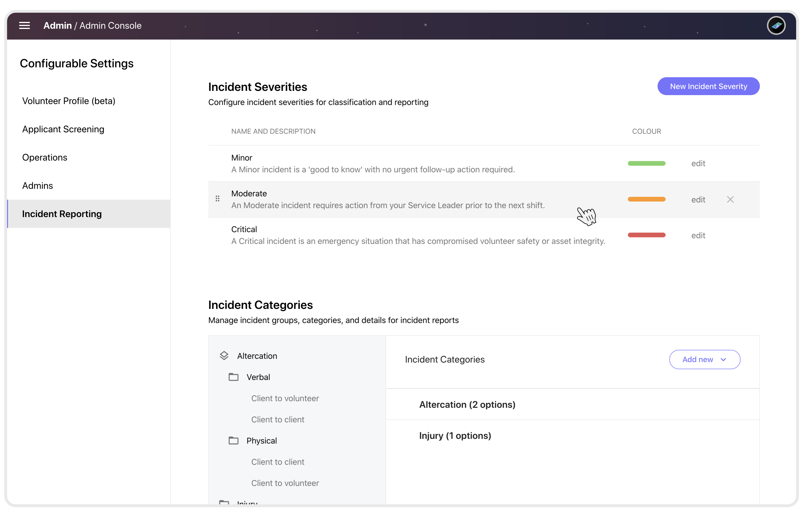
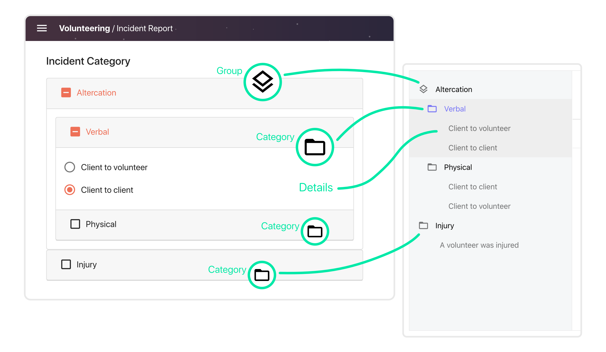
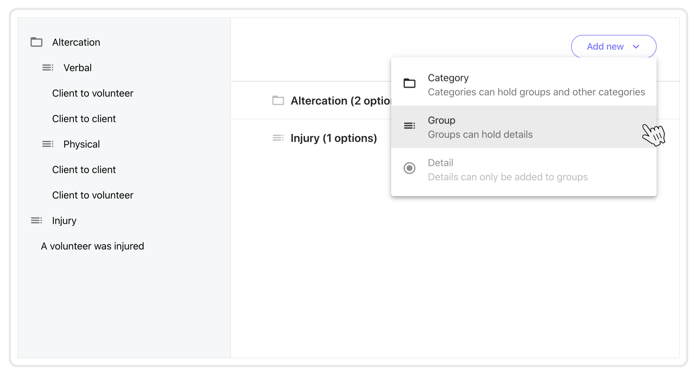
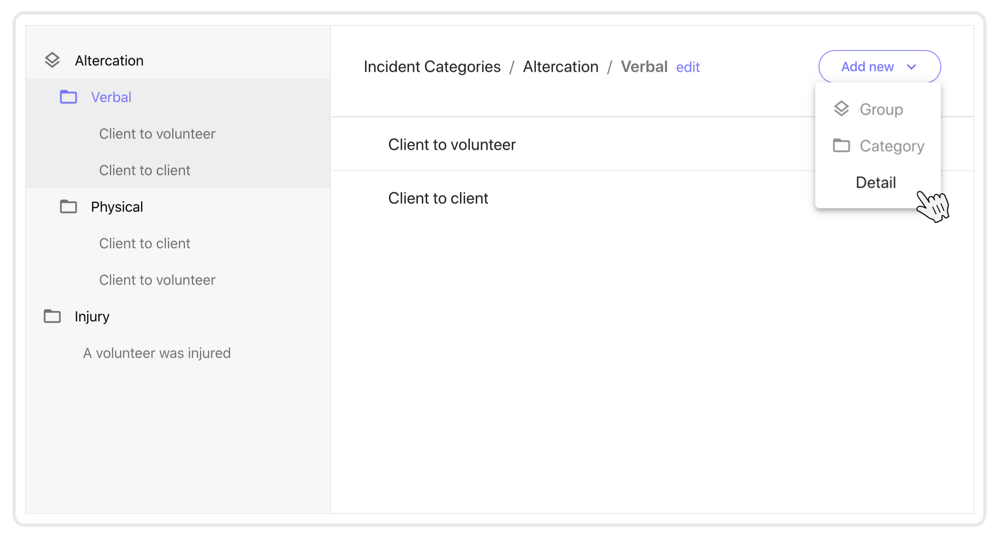
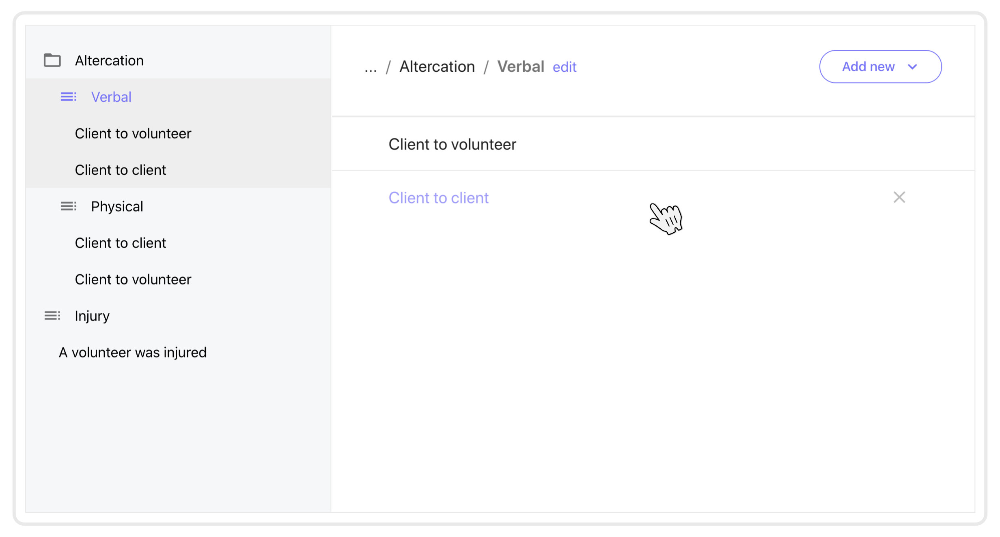

# Using the Admin Console
{: .no_toc }

## Build your Campfire
{: .no_toc }
{: .fs-10 }

The Admin Console is the home all of the most important settings for your Campfire. Understanding these options and how they affect other parts of Campfire is important. This guide looks at each of the panels on the Admin Console to give an overview of the system, as well as showing how to use the various interfaces.

---

## Skip To
{: .no_toc .text-delta }

1. TOC
{:toc}

---

## Applicant Screening
{: .fs-10 }

Before new volunteers have their accounts created they go through sign up. If you want to filter volunteers at this stage you can do so using screening questions. If you want every new volunteer to require manual approval you can turn auto-applicant approval off entirely.

### What are screening questions

Screening questions are presented to new applicants as a final check before they submit they create their account. This is the step before they sign in and begin the volunteer profile setup stage.

### Editing screening questions

Screening questions can be added using the Admin Console. Each question can be assigned a correct answer, which can prevent new accounts from being automatically created if answered incorrectly. You can also re-order the questions using the handles on the left, and delete a question using the remove button on the right.

### Using Auto-approve Application

Auto-approve applications is normally kept on. With this setting on, applicants will receive their account straight away (so long as they pass all screening questions and verify their email address) and will be able to start setting up their volunteer profile.

## Volunteer Profile (beta)
{: .fs-10 }

> The volunteer profile page is a reflection of what your applicants will see after their account is created. This is the volunteer profile setup stage of onboarding. We are planning upgrades to this system which will allow full control and setup of this interface - stay tuned!

## Operations
{: .fs-10 }

The Operations panel contains settings for cancellation and closure options. These are important pieces of config as the data that comes from cancelled rosters and closed activities will provide valuable insights whenever you're reviewing your operations history.

These items can be re-ordered using the handle on the left, and removed using the button on the right. Removing cancellation or closure reasons will not affect any history.

### Cancellation reasons

Cancellation reasons are used when a manger is cancelling a roster. Cancelled rosters are indications that an activity is generally healthy but was unable to be delivered for that particular date. Rosters can be cancelled at any time before or after they were supposed to run.

Missed activities are an indication of uncertainty. Ideally there will be no missed activities that have not been either completed by retro-actively submitting an activity report, or cancelled by cancelling the past roster/report.

### Closure reasons

Closure reasons are used when an activity is being closed. Closing an activity is considered more severe, and often more permanent than suspension. Closed activities can be opened at any time if circumstances change.

## Admins
{: .fs-10 }

Administrators can manage other admin accounts through this panel. Your Campfire must always have at least one admin account, so we won't let you remove your last one!

<!-- ### Understanding admin privileges -->

<!-- Admins do things... -->

### Adding or removing admins

Existing users can be upgraded to administrators using the `Add admin` button. Existing admins can be removed with the remove button on the right.

## Incident Reporting
{: .fs-10 }

Having a good safety culture is crucial. Campfire aims to provide a platform for detailed incident reporting through configureable incident severities and categories. These settings are reflected on the Incident Report, and can be customised to fit your style of operations.

### Incident Severities

Every incident report requires a severity to be selected. Each severity should indicate a different level in a triage. It is a good idea to have your own processes in place around how to handle each type of incident based on what severity it was reported with.

Severities can be edited using the `edit` button, where a name, description, and colour can be assigned. These are all displayed to the person who is completing the incident report.

Severities can be re-ordered using the handle on the left, and removed using the button on the right.

### Incident Categories

Categorising incidents is critical to gaining insights into the risks that may emerge as your teams and operations grow. Campfire has a particular structure to incident categories which allow for many layers of sub-groupings before a final option is presented.

On the incident report, categories and groups behave identically -- they are effectively folders which contain more layers. The difference between a category and a group is that a group can only contain `Details`. This means that a group will be the last layer that is created before details are finally added.

- The root can contain categories or groups
- Categories can contain other categories, or groups
- Groups can contain only details

You can preview the configuration at any time by viewing the Incident Report.

#### Groups and Categories

At the root level (`Incident Categories`) categories and groups can be added. In _Altercation_ has been added as a categories so that more groups can be added within, while _Injury_ has been added as a group so that details can be added immediately.

Details can be added to groups, but not directly to categories or the root level.

Inside of categories and groups the `edit` button (at the end of the breadcrumbs) can be used to edit the name.

#### Details

Click on any existing detail to edit the label. Details can be removed using the remove button on the right.

