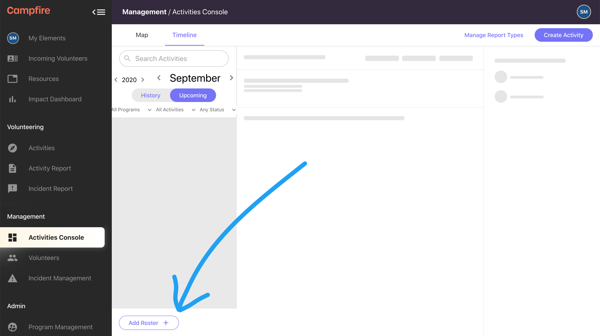
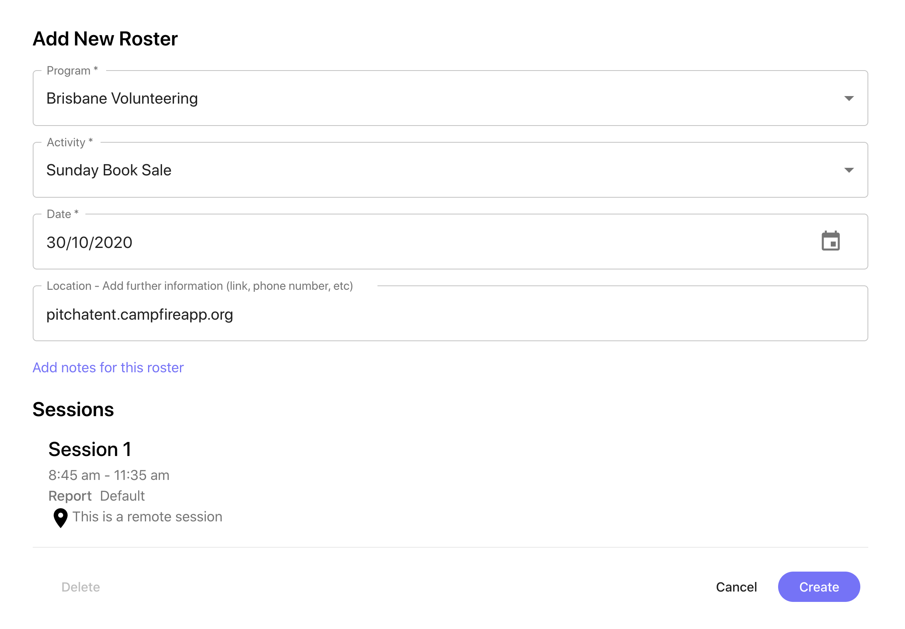

# Create an instant roster
{: .no_toc }
{: .fs-10 }

---

## Skip To
{: .no_toc .text-delta }

1. TOC
{:toc}

---

Instant rosters should be created as needed. They’re mostly used in flexible activities to designate dates that the activity will be running. Besides flexible activities, instant rosters can also be used to create ad-hoc rosters on regular activities in case the activity needs to run on a date that doesn’t match the normal frequency.

**What you’ll need to create an instant roster:**

- Program manager or admin privileges

## Adding a new instant roster
{: .fs-8 }

You’ll usually want to begin by selecting the activity that you’re creating the roster for. Find and select the activity from the activities console map view. With the activity overview open (or at any point from the activity console timeline view) hit the Add Roster button at the bottom of the monthly directory.

We can now fill in the details to add the instant roster. Normally, the only thing that needs to be picked is the date. If you already selected an activity beforehand, the program and activity won’t need to be changed; otherwise you’ll need to choose the program and activity manually.

1. (Pre-filled) **Program**: Select a different program to access other activities
1. (Pre-filled) **Activity**: Only activities from the selected program will be shown here
1. **Date**: Select the date for this roster
1. (Inherited) **Location**: The location for an Instant roster is inherited from the Activity but can be overridden if needed.
1. (Optional) **Notes**: Add notes to share specific info with volunteers once they’re rostered.
1. (Inherited) **Sessions**: All sessions that belong to the original activity will be included on the instant roster. Inherited sessions cannot be edited at this time.

With all of these details complete, the instant roster can be created. You’ll be taken to the newly generated empty roster for the date that was selected. From there you’ll add volunteers like any other roster.

## What's next?
{: .fs-8 }

Read more about [editing instant rosters](/docs/managers/editing-instant-rosters) or [deleting instant rosters](/docs/managers/delete-an-instant-roster)
