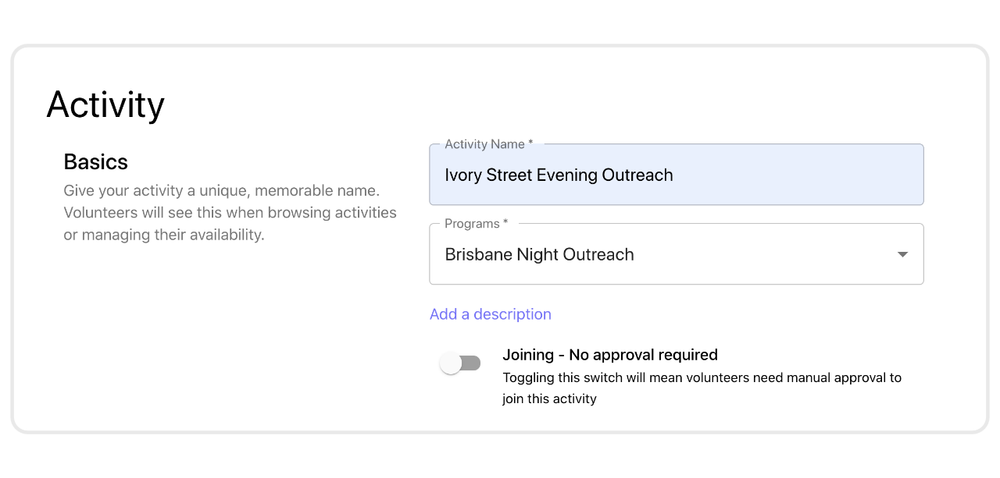

# Creating activities
{: .no_toc }
{: .fs-10 }

---

## Skip To
{: .no_toc .text-delta }

1. TOC
{:toc}

---

## Basics
{: .fs-10 }

* **Name**: Give your activity a unique, memorable name. The name is used to identify the activity across most interfaces, including the _All Activities_ screen, the _Activity Report_, and the _Impact Dashboards_.
* **Program**: Every activity needs to belong to a program. Programs are used to group activities and volunteers together. [Read more about programs and Campfire's structure](https://guide.campfireapp.org/docs/managers/introduction-to-activities/#campfire-structure)
* **Description**: You can _add a description_ to include general information on the activity. The activity descriptions are visible to volunteers even before they've joined the activity's team.
* **Joining policy**: You may choose to switch the activity to _open_. An open activity will allow volunteer to join the activity instantly and start applying for rosters, without needing to wait for a manager to approve them.

