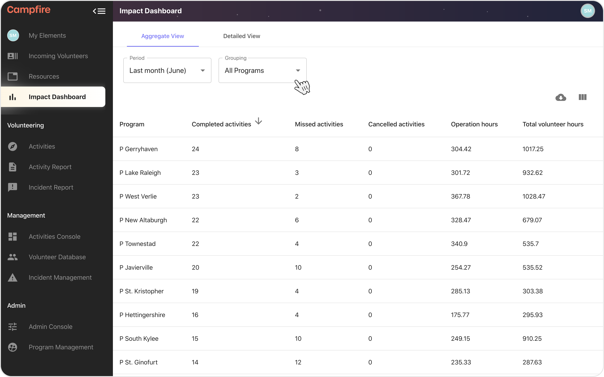
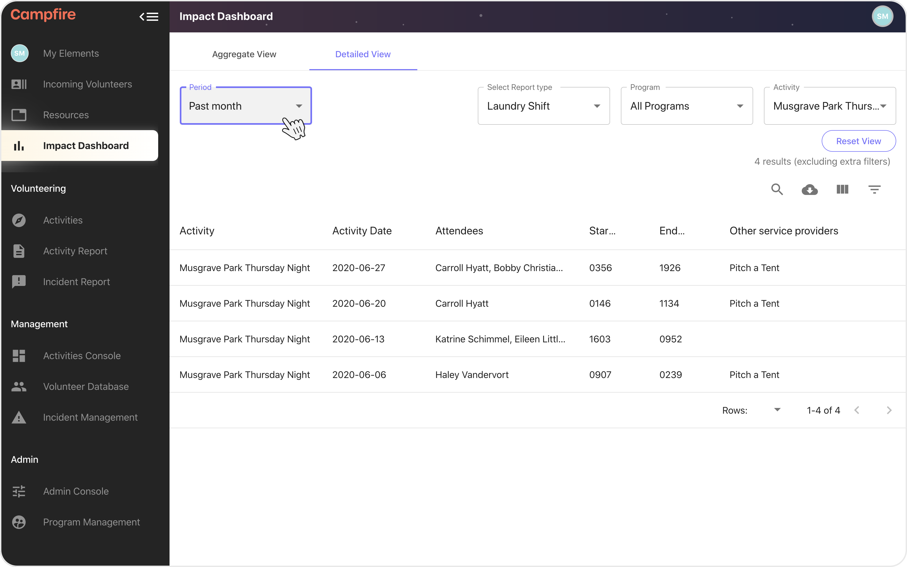
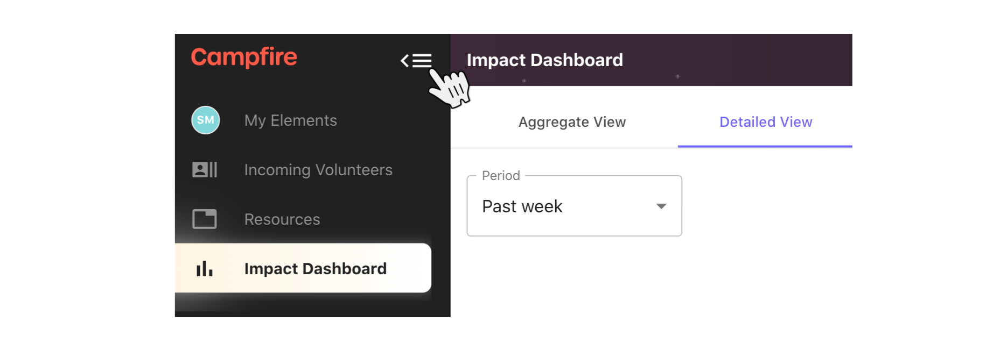
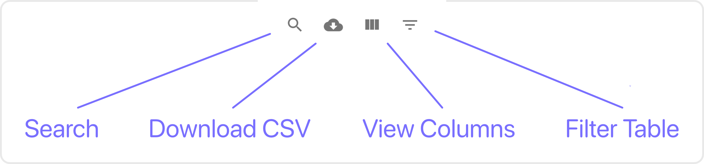

# The Impact Dashboard

{: .no_toc }
{: .fs-10 }

Your data is important. Having access to all of the aggregate and individual reports across all of your teams can provide valuable insights, and is critical for measuring and reporting your impact.

---

## Skip To

{: .no_toc .text-delta }

1. TOC
   {:toc}

---

## Aggregate View

{: .fs-10 }

The Aggregate View shows you a summary of all of the numbers that have accumulated through your activity reports. The columns are broken into to major portions; the first group are the operational status, and the second group are your impact measurements.


{: .my-8 }

### Operational Stats

The first 5 to 7 columns on the Aggregate View will always include the operational stats. These are the numbers that Campfire has collected as your activities have been running.

- Completed activities - The number of activities reports that have been completed or partially completed.
- Missed activities - The number of activity reports that have not been started, and the corresponding activity has not been cancelled.
- Cancelled activities - The number of cancelled activities.
- Operation hours - The total number of hours that all activity reports have accumulated. Session reports are counted individually.
- Total volunteer hours - The number of cumulative hours for every individual volunteer attendance across all of your activity reports. Session reports are counted individually.

### Period

Adjust the time window on the aggregate view using the period input. We've included a few easy defaults to help with your reporting. The custom option is included so that you can narrow the dates down to whatever range you need.

- All time - All stats that Campfire has collected since the beginning of time.
- This month - Everything captured from the start of the current month until the current day.
- Last month - Everything from the last calendar month.
- This year - Everything since the beginning of the current year.
- Custom - Allows you to choose your own dates.

### Grouping

Your aggregate status can be grouped at different levels of detail. This is useful for more precise reporting, and can be used to download different views for reporting.

- Organisation - The totals across the entire organisation.
- All Programs - The totals broken down by each program.
- All Activities - The totals broken down by each activity.
- Your Programs - The totals broken down across all programs that you're a member of.
- Your Activities - The totals broken down across all activities that you're a member of.

### Using the Table Options


{: .my-8 }

#### Download CSV

Save the table to your computer in CSV format.

#### View columns

Use this menu to show/hide columns to make it easier to find and compare the data that you want to see.

---

## Detailed View

{: .fs-10 }

To get into the nitty-gritty, we've given you the Detailed View. This part of the Impact Dashboard allows you to access all parts of individual activity reports, across your entire organisation, and through any range of dates.


{: .my-8 }

### Choosing your view

The first thing that you'll need to select is a Report type. We recommend limiting the number of Report types that you use simultaneously as each different report type selected will increase the number of columns that the table needs to load -- and lots of these might be empty if your Report types don't have a lot of overlap.

After you've chosen a Report type you can filter the Programs and Activities that are loaded. Each of these menus includes a `Select all` and `Deselect all` option at the bottom of their lists. This is useful if you want to target a single Program or Activity; just hit `Deselect all` and then re-select the items you want to focus on.

You can reset these settings any time using the `Reset View` button.

---

```
🏕 Campfire Tip

Hide the side nav using the button in the top left to give yourself more space. The same button can be used again to open the side nav when you're done.
```


{: .mb-8 }

---

### Period

You can adjust the time window for the data that you're viewing using the period setting. We've included some easy to use defaults, but the 'Custom' setting will allow you to choose your own dates if that's what you need.

- All time - All stats that Campfire has collected since the beginning of time.
- Today - Everything that has come in since midnight.
- Yesterday - Everything that was captured the day before.
- Past week - Everything from the last 7 days.
- Past month - Everything from the last 31 days.
- Past year - Everything from the last 365 days (sorry leap years 😥).
- Custom - Allows you to choose your own dates.

### Using the Table Options


{: .my-8 }

#### Search

Search the entire table across all columns (this might slow down your machine for a moment if you have a lot of data loaded).

#### Download CSV

Save the table to your computer in CSV format.

#### View columns

Use this menu to show/hide columns to make it easier to find and compare the data that you want to see.

#### Filters

Advanced filters to target specific data on individual columns.
