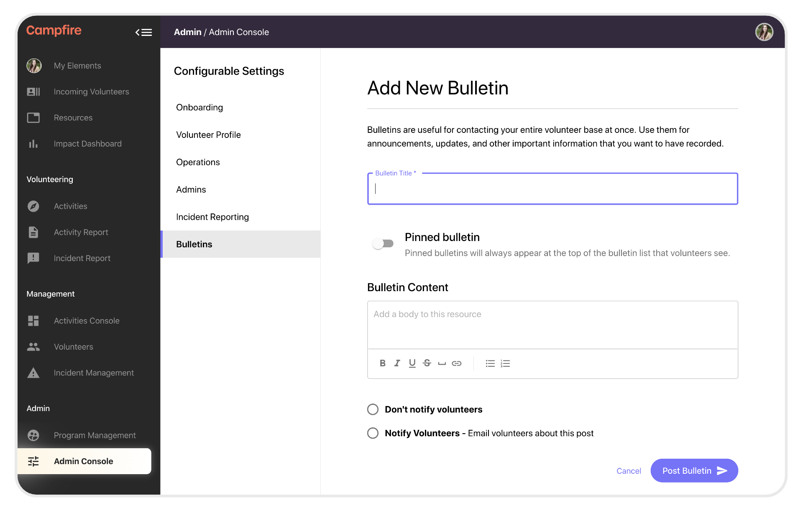
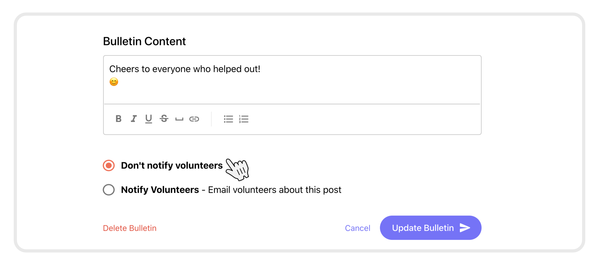

# Posting updates with Bulletins
{: .no_toc }
{: .fs-10 }

---

## Skip To
{: .no_toc .text-delta }

1. TOC
{:toc}

---

## What are bulletins?

Bulletins are an easy way to post updates and share important information with your volunteers.

## Global bulletins
{: .fs-10 }

Global bulletins can be added through the _Admin Console_ using the _Bulletins_ panel. Bulletins added here are visible to everybody. Volunteers will see these updates on the _My Elements_ page.

* Title: Give your bulletin a short, descriptive name so that people know what the update is about and can find past information easily.
* Pinned: Switch this on to keep your bulletin pinned to the top of the list. You can come back to existing bulletins and toggle this on or off at a any time 
* Content: Put as much information as you need in the bulletin. If you've [created a resource](https://guide.campfireapp.org/docs/managers/uploading-content-with-resources/#formatting-and-styling-with-the-text-editor) before you'll be familiar with this rich text editor.
* Notify: Choose whether or not to notify your volunteer of this bulletin. If this is on, every volunteer will be notified that a bulletin has been posted. 

You can use the _Admin Console_ to edit existing bulletins.

You may choose to notify volunteers whenever you edit a bulletin, but be mindful that small changes to existing bulletins might not be worth notifying your volunteers

You can also delete bulletins at any time. Be careful with deleting important information if it isn't stored anywhere else.