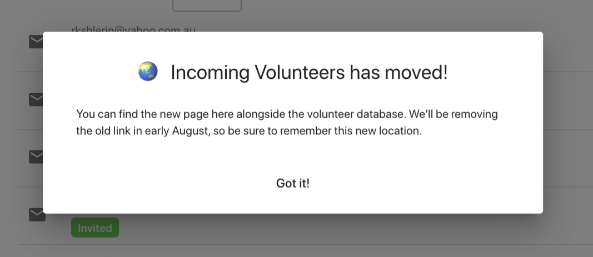
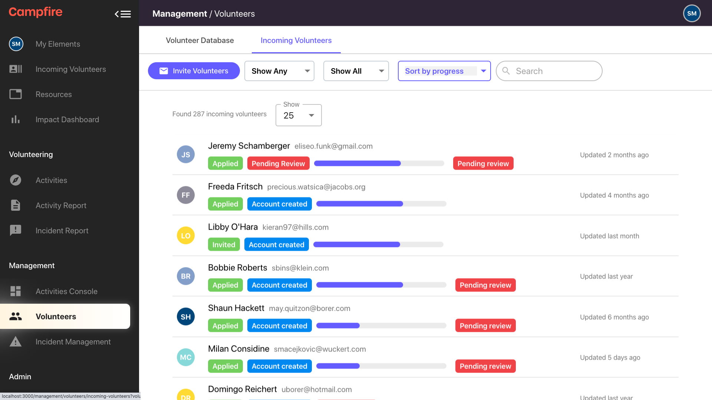

# Tracking Onboarding using Incoming Volunteers
{: .no_toc }
{: .fs-10 }

There have been a couple of changes with the Incoming Volunteers page that will assist you with tracking the progression of your applicant volunteers.

---

## Skip To
{: .no_toc .text-delta }

1. TOC
{:toc}

---

## New Location for Incoming Volunteers
{: .fs-10 }

First thing to note is that the Incoming Volunteers page has been absorbed by the Volunteer Database page which now becomes a "Volunteers" page. For the next few days, we will leave the tab for the old Incoming Volunteers page in the sidebar, but when you click onto it, a pop-up box will appear (pictured below) that will remind you of the change and redirect you to the new Volunteers page.

{: .my-8 }

## Filters
{: .fs-10 }

A couple of new features to note here will be your ability to filter down your applicants to their applicant states.

### Filter: Show Any/Show Applicant/Show Only Invitees

- Show Any is where you will be able to see all of your applicant volunteers at any stage of their application process

- Show Invitees is how you can see the list of your potential volunteers who have been invited into Campfire by a manager. These volunteers would not have accepted the invitation yet, therefore have not progressed to the next stage of setting up their volunteer profile. From this point, you can click into their name and see the two functions, either Revoking the invite, or Resending the invitation.
  Revoking an invite means that the link sent to the volunteer on the invite email will no longer be functioning therefore, if the potential volunteer would like to proceed in that application process, they will need to start at the very beginning of the application process.
  Resending the invite to a potential volunteer means that you are pushing that email invite from Campfire back to the top of their inbox.
  NB: sending an invitation to a potential volunteer allows them to skip the screening question you can design for them in the admin Console (if you would like to help in designing those, see {link}).

- Show Applicant is where you will be able to filter you applicant volunteers to see who has created an account and potentially has started creating their volunteer profile by completing the tasks you have set for them. If next to their "Account Created" status on this filtered a progress bar appears then have been successful in submitting completed tasks (see below for reference).

From here you can click on any listed applicant volunteer to gauge what tasks they have or have not submitted. If some appear with the red Pending Review box then this is where an action from a manager is required to allow their progression in their volunteer profile set up/completion.

{: .my-8 }

### Filter: Show All/Show Pending Review

Show All is how you can see all of the volunteers in your list, depending on your other filter selections.
Show Pending Review is where you will be able to filter down to see only the volunteer applicants who have submitted tasks that require a manager's approval. See {here} for how to set tasks on manual (manger's) approval or automatic.

### Filter: Sort by Recent Activity/Sort by Progress

Sort by Recent Activity is how you can filter your volunteer applicants depending on how recent they have been active in the onboarding process. This can be for any state of volunteer applicant.
Sort by Progress is where you can filter you volunteer applicants in the order from someone who has completed (or almost complete) each task in the Volunteer Profile all the way down to someone who has submitted their answers to the screening questions.

## Incoming Volunteer States
{: .fs-10 }

### Invitee

They have been invited by a manager to complete the volunteer profile tasks set. This means that they will bypass the screening questions created.

### Applied // Account Created

They have either been automatically approved in the screening questions round or accepted the invitation in the invite email to therefore create their Campfire account

### Applied // Pending Review

They have completed tasks set by a manager that now require manual approval. If this is the last task to approve for this applicant, the button would change from Approve Task to Approve Volunteer Profile. Once a volunteer applicant has had their entire volunteer profile approved they will no longer exist in the incoming volunteers page and move to the volunteer database.
