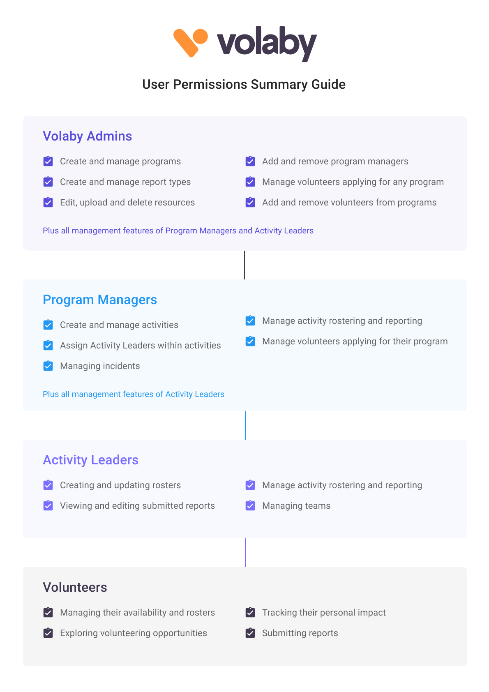

# Volaby Permissions Guide

## Volaby Admins

* Create and manage programs
* Create and manage report types
* Edit, upload and delete resources
* Add and remove program managers
* Manage volunteers applying for any program
* Add and remove volunteers from programs
* Plus all management features of Program Managers and Activity Leaders

## Program Managers

* Create and manage activities
* Assign Activity Leaders within activities
* Managing incidents
* Manage activity rostering and reporting
* Manage volunteers applying for their program
* Plus all management features of Activity Leaders

## Activity Leaders

* Creating and updating rosters
* Viewing and editing submitted reports
* Manage activity rostering and reporting
* Managing teams

## Volunteers

* Managing their availability and rosters
* Exploring volunteering opportunities
* Tracking their personal impact
* Submitting reports
