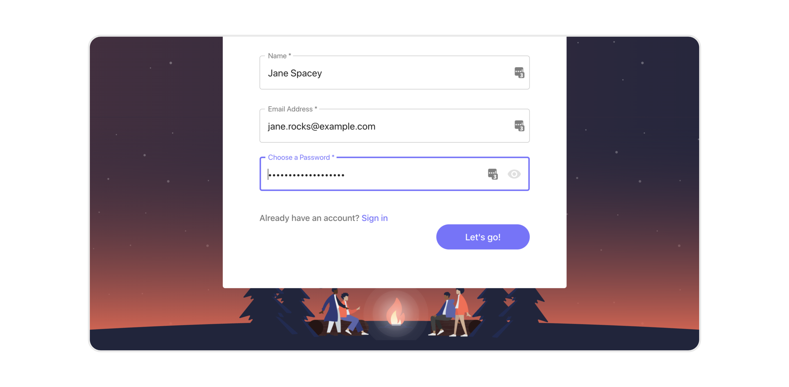
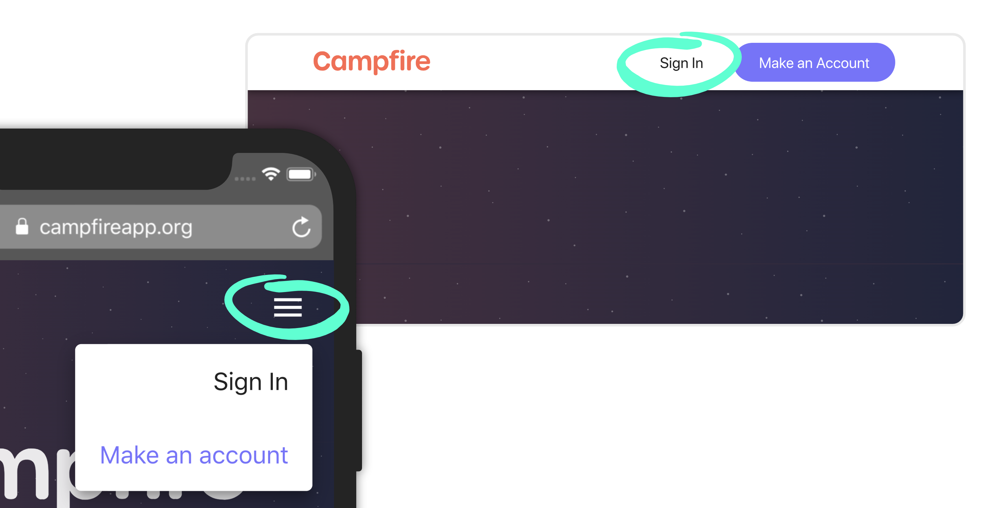
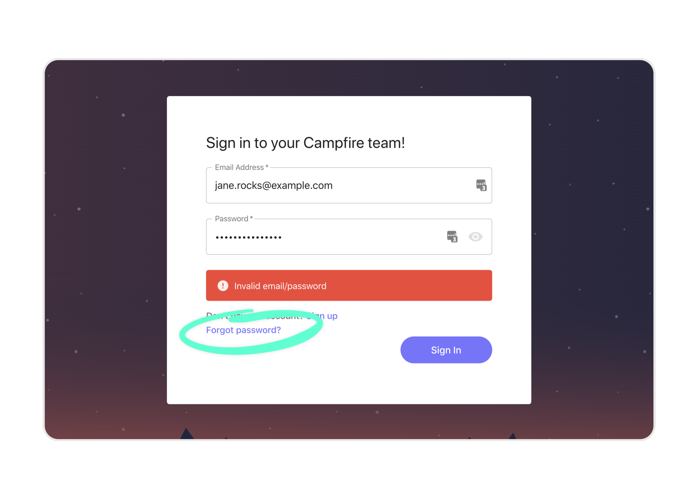
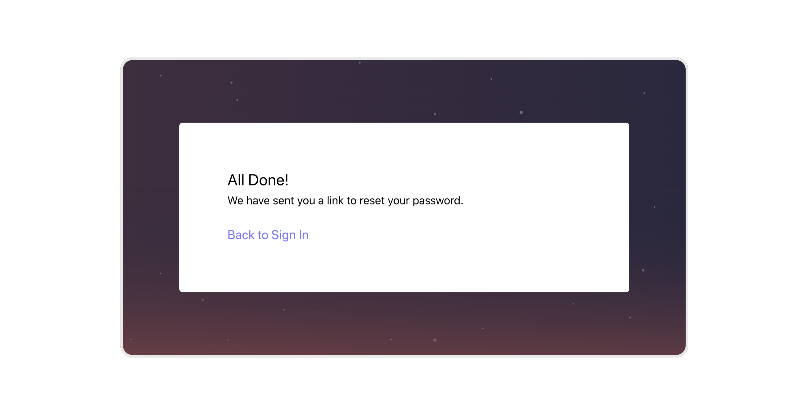

# Creating your Campfire Account
{:.no_toc }

## Welcome to Campfire!
{:.no_toc .fs-10 }

Campfire can do lots of things for you and your team. Before you join the rest of your team you'll first need to set up your profile.

---

## Skip To
{:.no_toc .text-delta }

1. TOC
{:toc}

---

## Sign up
{:.fs-10 }

### Creating an account using the Sign Up form

To create an account you need to visit the Sign Up form. You'll normally be directed here through a link on a website, or via an email. The sign up form asks for three (3) simple things to create your Campfire account:

1. `Your name` (first and last),
2. `Your email address` (used to sign in to Campfire and receive news), and
3. `A password`

Fill these details out and continue to the next screen.

You might encounter a couple of screening questions. These are simple yes/no questions that give your organisation a little more information about yourself. Complete these to finalise your sign up.

If everything looks good you'll be sent to the email verification step. You will have received an email from `postman@campfireapp.org` (be sure to check your junk) asking you to verify your email address. Follow the link provided in the email to complete this verification. Once this is done you can return to your original Campfire tab, where you'll be signed into your account.

Sometimes your organisation needs to review your sign up application first. Once this has been approved you'll receive another email from `postman@campfireapp.org` with further instructions on on verifying your email address and finalising your sign up.

### Activating your account after receiving an invitation email

If you've been invited to Campfire by someone already in your team then your sign up process will be a little faster than what is described above.

Follow the link in the email to the sign up form, where you'll find your email address already filled in. Just enter your name and choose a password. If you want to use a different email address you can do that too.

Once you've selected a password you'll be taken straight through to the next stage, setting up your profile!

## Setting up your profile
{:.fs-10 }

Your organisation likely has some tasks for you to complete while setting up your profile. You'll find these under `Your Tasks`. If this option doesn't show up then, Congratulations! 🎉 You can go straight through to the `Volunteer Profile Form` and submit your details there.

### Completing 'Your Tasks'

The tasks listed under the `Required Tasks` section will need to be completed before accessing your `Volunteer Profile Form`. Click into any task to view the requirements and find out what you need to complete it.

Each of your tasks will normally involve answering some questions or providing some details about yourself. Some tasks will have `Attachments` for you to open or download. Some tasks may also ask you to upload your own attachment using an `UPLOAD RESOURCE` button.

You'll normally find instructions at the top of each of your tasks. Read through the questions carefully, enter your responses, then hit `Submit` button at the of the page once you're done.

If you need to change any of the responses to a completed task you can open it and click on `Submit New` to start over.

#### Extra Tasks

Anything listed in the `Extra Tasks` section may not be required to complete your initial profile, but might be good to include depending on your role in the team. Read through these carefully to see if any make sense to complete, given your situation.

### Submitting your 'Volunteer Profile Form'

The `Volunteer Profile Form` is an opportunity to provide important details to your organisation. This includes your home and mailing address, and an emergency contact. You'll also have the chance to share any health condition information that might be necessary to keep you and others safe.

Once you've completed the form hit `Submit Volunteer Profile` at the bottom of the page to package everything up and send it off.

Some teams will manually verify your volunteer profile, so you might need to wait for this to be done. We'll email you when your profile has been processed.

## Next Steps

As soon as your volunteer profile is completed you'll be signed in to your Campfire volunteer account. Welcome to Campfire!

Check out the [guide on applying to join a team](../volunteering/applying-to-join-a-team.md) for some things that you can do next.

---

## FAQs

### Why do I keep seeing a network error on the sign up screen?

If you find yourself encountering a `Network error` on the Sign **Up** screen then there's a chance that your email address is already in use.

Head back to the Sign **In** screen (using the `Sign In` button in the menu at the top of the the page) and try using your email address and your Campfire password.

### What can I do if I've forgotten my password?

If you don't remember your password hit the `Forgot password?` link on the sign in screen.

Enter your email address and we'll have a password reset link sent to you. The email will come from `postman@campfireapp.org`. Be sure to check your spam/junk folders.

