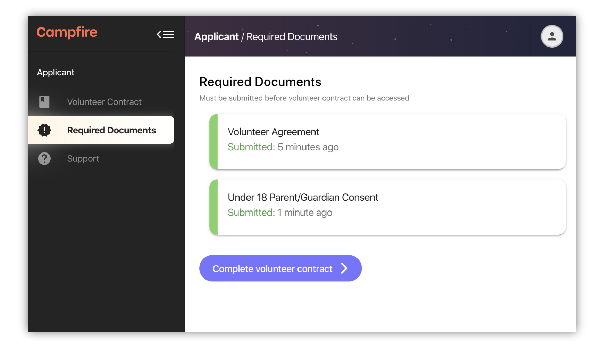

# Signing up to Campfire

Before you begin your volunteering journey on Campfire, you'll need to have a Campfire account. This article outlines the steps to help get you set up.

## Creating your Campfire account

### Application form

The first step is the application form. The application form contains a basic set of questions. The link to this form will be provided by your organisation.

### Email confirmation

After you have submitted your application form, you'll receive an email from `postman@campfireapp.org` (our Campfire mail server)

This email will either be:

1. A confirmation email letting you know your application was received and is awaiting verification, or
2. A welcome email giving your first time sign in details.

Once you receive the type `2.` email you're ready to sign in to Campfire and continue with your journey. If you received `1.` then you are just waiting for your organisation to see your application and approve it.

### Signing in

Use the password that was emailed to you to sign in. The first time you sign in you'll be required to set a password. This password should be secure, as it will be used to sign in to Campfire from then on.

You can always change your password later. If you forget your password and can't sign in, follow the `Forgot Password?` link on the sign in page and enter your email; you'll receive instructions for resetting your password from there.

## Required documents (if applicable)

Depending on your organisation’s requirements, you may need to complete some prerequisites to the volunteer contract. Each of these can be filled out individually. Once you're done you'll be able to access the volunteer contract.

## Volunteer contract

The volunteer contract is the final step in your application process. This is an opportunity to provide your important details to your organisation, including your home and mail address, and an emergency contact. Hit `Submit` when you're done.

### Contract verification

After you submit your contract you'll enter one of two pathways:

1. Your organisation will receive and verify your contract. We'll send you an email from `postman@campfireapp.org` once your contract has been approved and your volunteer account is ready, or
2. If automatic verification is configured and successful, your volunteer account will be activated immediately and you'll be able to continue with next steps.

> If you received your 'contract approved' email but you're still seeing the above message, try manually refreshing your browser

### Next steps

With your volunteer contract completed you can start your onboarding checklist. See the [guide on applying to join a team](../volunteering/applying-to-join-a-team.md) for more info.
