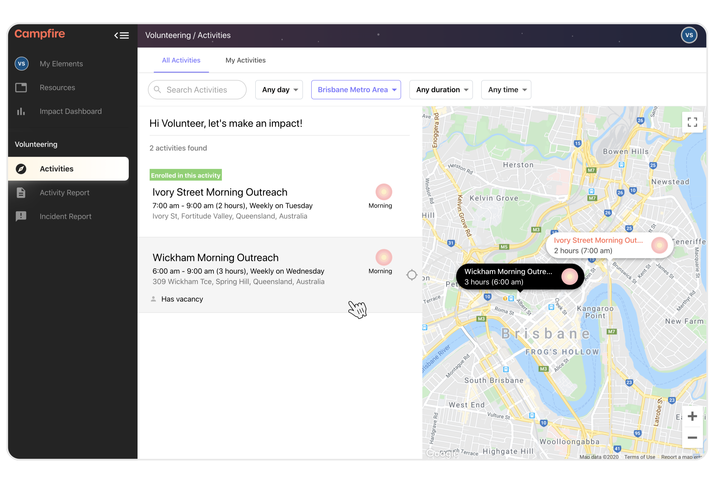
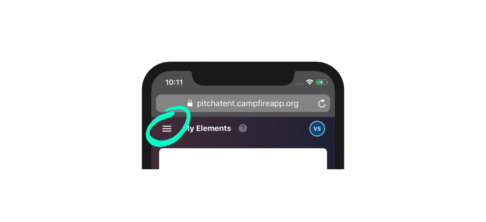
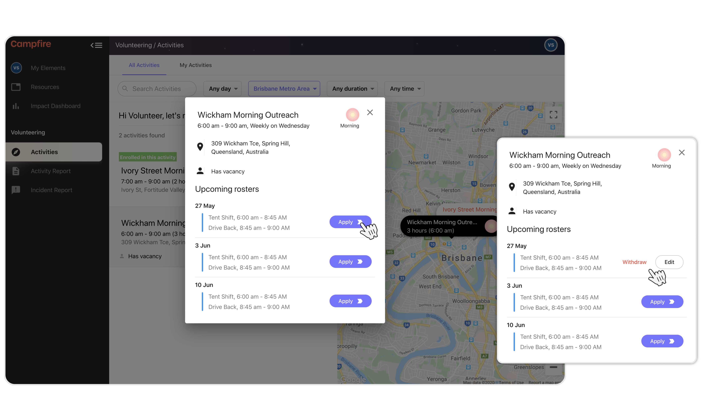
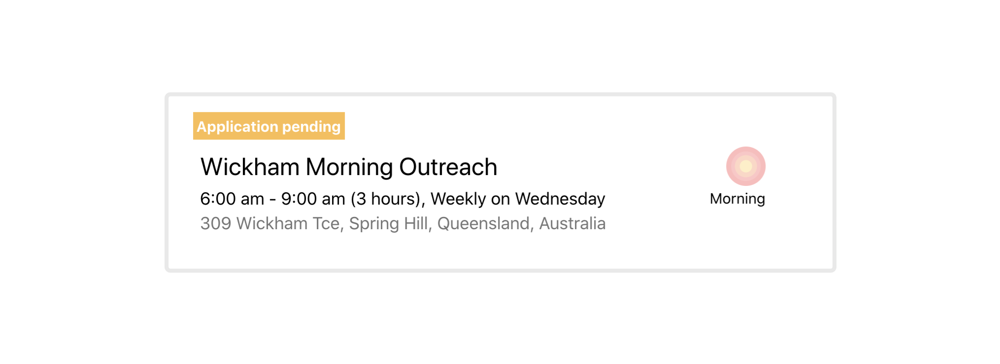
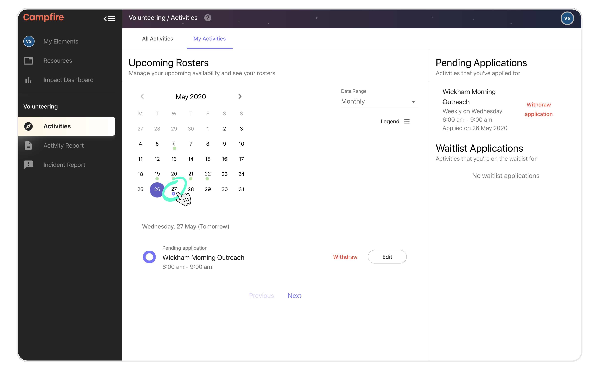
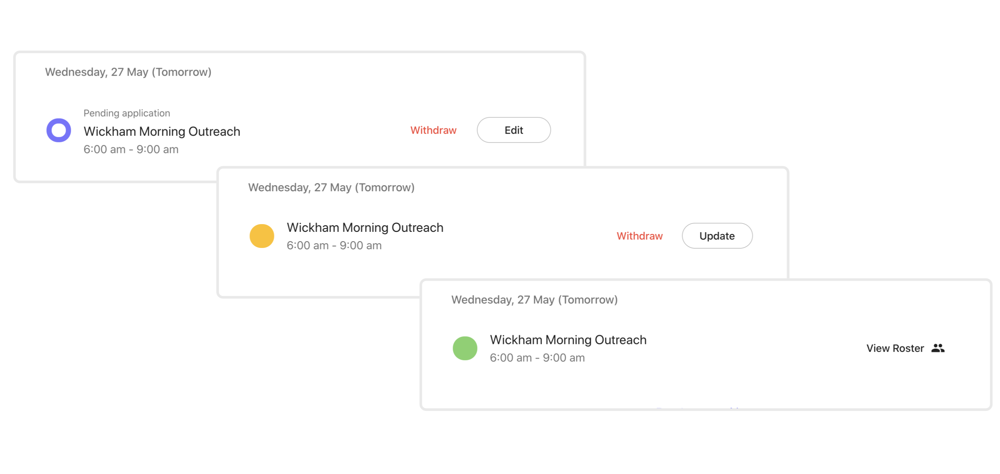

# Applying to join an Activity

The first step to volunteering on Campfire is to find an activity and join the team. Teams are groups of volunteers that are attached to an activity. You can browse all of the activities that your organisation runs by visiting the `Activities` page and selecting the `All Activities` tab. In this article we'll walk you through the important steps in joining a team, and highlight the features of the Activities page.

---

## Skip To
{: .no_toc .text-delta }

1. TOC
{:toc}

---

## Where to go first
{:.fs-10 }

Once your volunteer profile has been completed, you'll have access to your full volunteering account. The first page that you'll want to visit is the `Activities` page.

<!-- If this is your first time on Campfire, you'll also be greeted with an onboarding checklist `[1]`. You can open the onboarding checklist at any time, and click on the active step - which will be marked with a blue button `[2]` - to be taken to the right place. -->

If you're on a mobile device, the navigation menu can be opened using the menu button in the top-left corner of the screen.

## Finding an activity
{:.fs-10 }

Click on any activity on this page, or on a map marker, to open the activity info. From here you'll be able to apply for some of the upcoming dates in order to express your interest.

When you apply for an activity for the first time you are simply expressing your interest in joining the team. You should chose teams from activities that are in a time and/or place that makes regular volunteering easy for you.

Any activity that you have applied for will appear with the `Application Pending` status on this page.

## My Activities page
{:.fs-10 }

While you are waiting for a leader to review your team application, you can find your pending activities over in the `My Activities` tab.

Your pending activities will be listed on the right side of the page, while the main view will show the calendar with upcoming dates. You can click into any of the days on the calendar to see activities for that specific date (useful if you have lots of activities for a given week/month).

There are a number of statuses that your activities might be in. You can view all of them by opening the `Legend`.

To start with, you'll more than likely find one of three statuses on any new activity that you're in the process of joining:

1. ⏳ `Application pending` **(Purple Ring)** - you've expressed an interest in joining this activity and are waiting to be added to the team
2. ⏳ `Enrolled and available` **(Amber Circle)** - you've been added to the team and you're still available for this date but haven't been rostered
3. 🎉 `Rostered` **(Green Circle)** - you're on the team and you've been rostered onto this date

We'll email you as soon as any of these statuses change. You'll be notified when your application to join an activity is approved, and of any further rosters that you are included on.

Be sure to visit the `My Activities` page regularly to keep your availability up to date.
