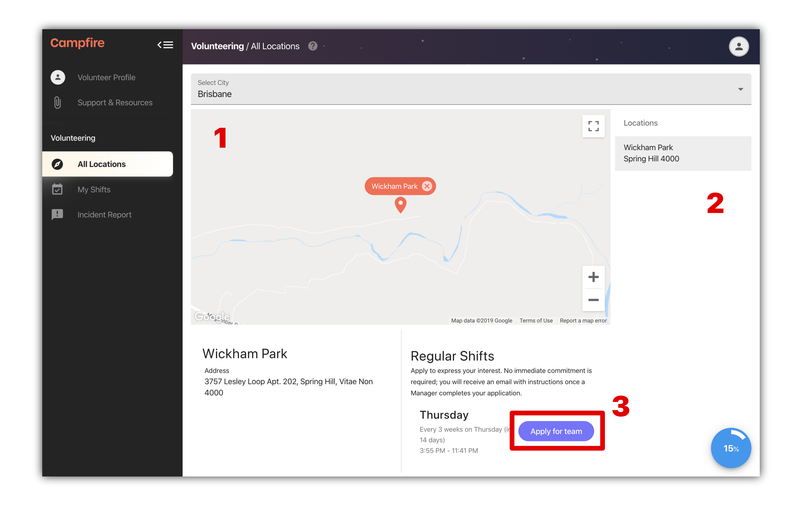

# Applying for a team

The first step to volunteering on Campfire is to find a team. Teams are groups of volunteers that are attached to a regular service. You can browse all of the services that your organisation runs by visiting the _All Locations_ page. In this article we'll walk you through the important steps in joining a team, and highlight the _All Locations_ page.

## What you'll see first

Once your contract has been verified, you'll have access to your full volunteering account. The first thing you'll see is the _My Shifts_ page.

If this is your first time on Campfire, you'll also be greeted with an onboarding checklist `[1]`. You can open the onboarding checklist at any time, and click on the active step - which will be marked with a blue button `[2]` - to be taken to the right place.

_On this page:_

1. Onboarding checklist
2. Active step

Navigate to the _All Locations_ page, or click on the `Find a team [2]` step if you have the onboarding checklist.

If you're on a mobile device, the navigation menu can be opened using the menu button in the top-left corner of the screen.

## Finding a team using All Locations

The _All Locations_ page provides a complete overview of the services within your organisation. Each of these locations will have a list of regular shifts (or once-off shifts if your org is running events).

Open a location by clicking a pin on the map `[1]` or by selecting it from the locations list `[2]`.

Once you have a location selected you will see the details open underneath. From here you can apply to join any team by hitting the `Apply for team` button `[3]`.

_On this page:_

1. Locations map
2. Locations list
3. Apply for team button

When you apply for a team you are simply expressing your interest in joining the team that runs that particular shift. You should chose teams from shifts that are in a time and place that makes regular volunteering easy for you.

While you are waiting for a manager view your team application, you can find your pending enrollments back on your _My Shifts_ page.

As soon as a manager enrolls you in a team we'll send you an email. After that you'll be able to kick off your rosters and apply to get out on an upcoming shift.
