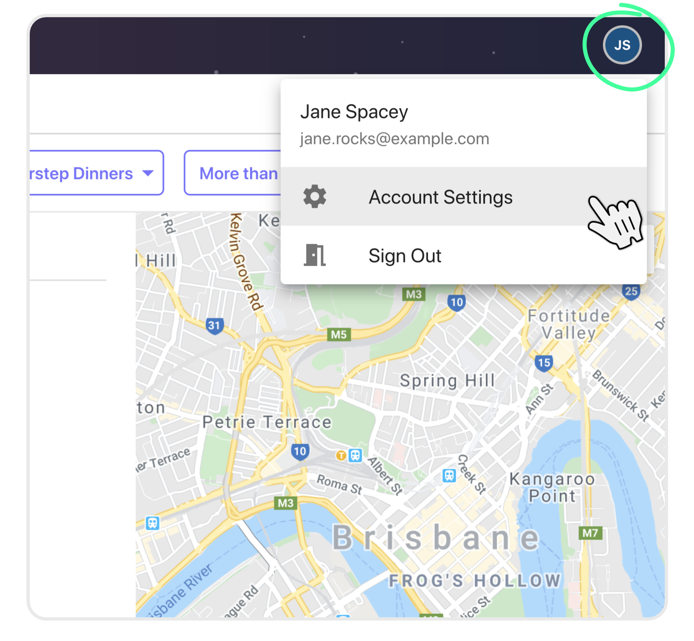
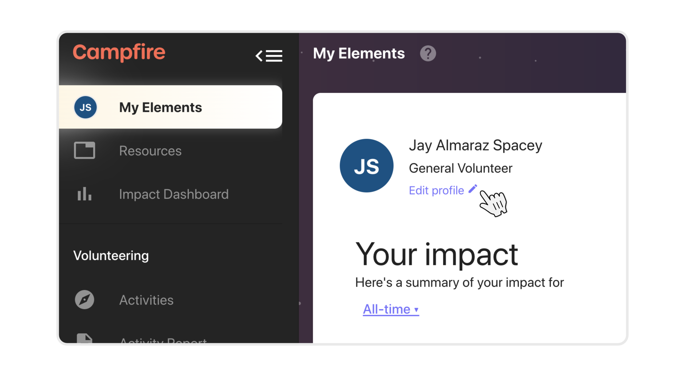
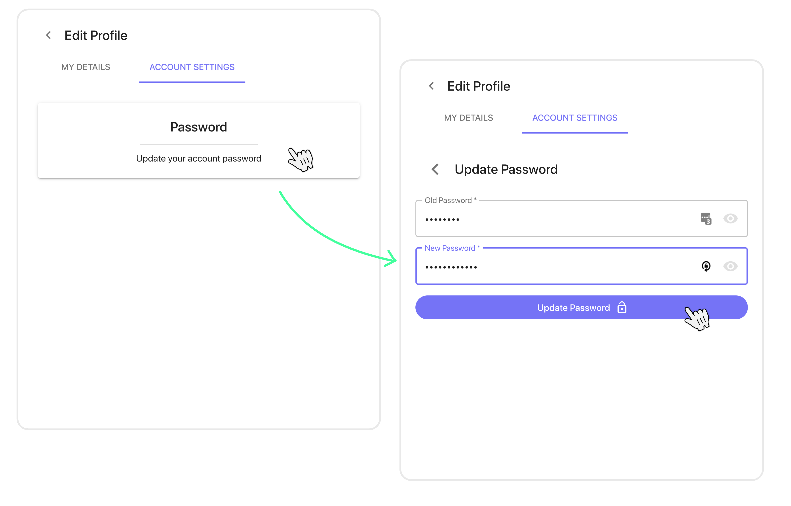

# Changing your password
{: .no_toc }

## Skip To
{: .no_toc .text-delta }

1. TOC
{:toc}

---

## Changing your password on Campfire
{: .fs-10 }

Changing your password while signed into Campfire can be done through your Account Settings. To access Account Settings simply open your user menu from the top-right corner of your screen and hit `Account Settings`.

Alternatively you can go to My Elements and select `Edit profile`, then select the `Account Settings` tab.

Once in Account Settings, open the `Password` screen and follow the instructions. You'll need to enter your existing password (Old Password) once, and then enter a new password. You can click on the `Eye` icon on the right side of each of the text boxes to show/hide what you're typing.

Once you're happy with your new password hit `Update Password`, and you're done! Your new password can now be used the next time you sign into Campfire.

---

## Can't sign in?
{: .fs-10 }

If you're having trouble signing in or you think that you have forgotten your password, you can check the [FAQs section of the account creation guide](https://guide.campfireapp.org/docs/sign-up#faqs) for info, including how to reset your password.
{: .mb-8 }