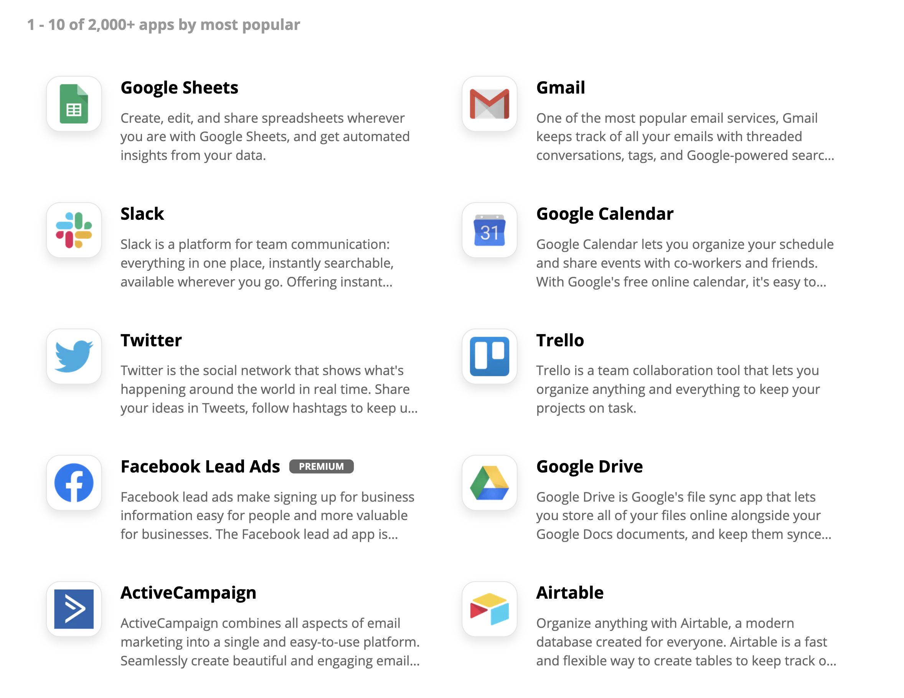
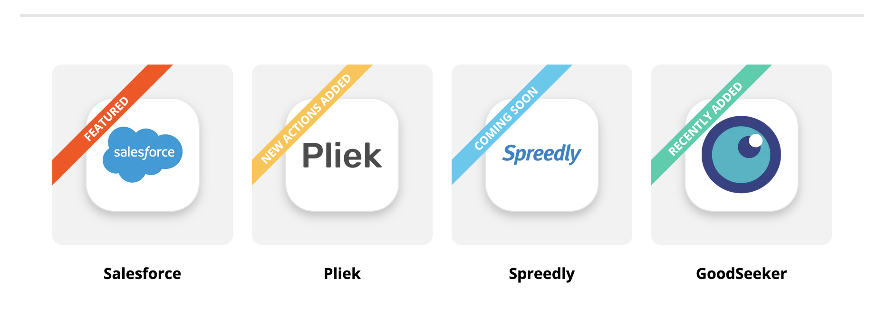

# Zapier Integration Roadmap
{: .no_toc .fs-10 }

We've been working on a Zapier App for Volaby. With nearly unlimited potential to integrate and automate workflows into other hugely popular and powerful applications, a Zapier App will be an exciting extension to Volaby's growing toolset.

_From Zapier's website_

> Zapier is an online automation tool that connects your favorite apps, such as Gmail, Slack, Mailchimp, and more. You can connect two or more apps to automate repetitive tasks without coding or relying on developers to build the integration. It's easy enough that anyone can build their own app workflows with just a few clicks.

This document covers the design and development of the Zapier App and integration principles that we are working toward.

---

## Skip To
{: .no_toc .text-delta }

1. TOC
{:toc}

---

## Our Philosophy on Integration

We want to make Volaby the best tool possible, and we want to stay in our lane. Volaby is built to be the single point-of-truth for your volunteer operations and impact data, but you're already using other tools to solve other problems. So how can we truly help you do more with what you've got?

We want to build integrations in key parts of Volaby, so that important information and powerful workflows can be automated from our platform to your other systems.

## Why Zapier?
{: .fs-10 }

We are aggressively familiar with the importance of integrations. From experience building Orange Sky tech, integrations provide huge benefits to the operational capability of a team who uses many tools. Volaby is build for volunteer management, and has been designed to provide a fantastic experience to volunteers and managers in coordinating and delivering your organisation's mission. We focus on doing what we do best, and now we want to provide a solution that will allow your team to use Volaby's data with other tools to take your processes to the next level.

Volaby is a tool by non-profits for non-profits, and we believe in providing the most amount of value to as many teams as possible. By building our Zapier App we will be giving teams and organisations of all sizes access to integrations that will help them with gain huge improvements their processes, at any scale.

Zapier was selected for our first integration project because it is connects with thousands of other web apps, straight out of the box. Zapier is designed to build workflows, and uses a trigger/action system to automate tasks in the background, leaving you even more time to focus on your mission.

[Read more about Zapier](https://zapier.com/how-it-works).

## Use Cases

- **Contact Sync**: Volaby will generate Zapier triggers whenever a volunteer profile is created, or potentially when contact information is updated. This will allow you to create, or potentially update contacts/entities within CRM systems.
- **Impact Sync**: Volaby could generate Zapier triggers as volunteer impact increases. This could be used to create and maintain simple records of volunteer contribution in CRM systems, or data visualisation tooling.
- **Mailing Lists**: Volaby could generate Zapier triggers whenever volunteers move between programs, or join a new type of activity. These volunteers could then be added to mailing lists, or even have welcome messages sent directly to their inboxes.

### Popular Zapier Apps

From the use cases above, and the triggers covered below, it's easy to imagine the vastness of possible workflows that Zapier x Volaby will enable. Here is a quick list of some of the most popular apps that are already on Zapier, all of which could be used to create actions from Volaby triggers!

.
.

[Explore all Zapier Apps](https://zapier.com/apps)

## Priority Triggers

We are pushing through the R&D phase and prioritising some critical triggers that will enable a major portion of needs in CRM integrations.

### Volunteer created

Triggered whenever a volunteer profile is completed. We see this as the most important trigger for CRM integrations. This trigger will allow contacts, records, and entities to be created or updated whenever a new volunteer joins Volaby.

The trigger will be broadcast after checkpoint 3 of the [onboarding flow](https://guide.volaby.org/docs/managers/configuring-your-onboarding-flow/#one-step-at-a-time) is passed, at the point where a volunteer has finished onboarding and had their volunteer profile approved.

| Primary data   | Secondary data  |
| -------------- | --------------- |
| User ID        | Program         |
| Volunteer ID   | Completed tasks |
| Date applied   | Approved by     |
| First name     |                 |
| Last name      |                 |
| Email address  |                 |
| Contact number |                 |

### Volunteer deactivated

Triggered when a volunteer is deactivated. The other side of the coin, being able to respond to volunteers being removed from Volaby is also critical to maintaining healthy data.

| Primary data     | Secondary data |
| ---------------- | -------------- |
| User ID          | Program(S)     |
| Volunteer ID     | Deactivated by |
| Date deactivated |                |
| First name       |                |
| Last name        |                |
| Email address    |                |
| Contact number   |                |

<!-- ## Future Triggers

After the priority triggers are stable and tested, we can start exploring all of the future possibilities. There is so much potential for creative and powerful workflows to follow. We'll be looking to connect with teams just like yours for ideas and opinions once we're ready to start prioritising and designing these triggers.

### Volunteer movements

### Activities and Programs

### Impact from activities

### Incidents

### Resources -->
