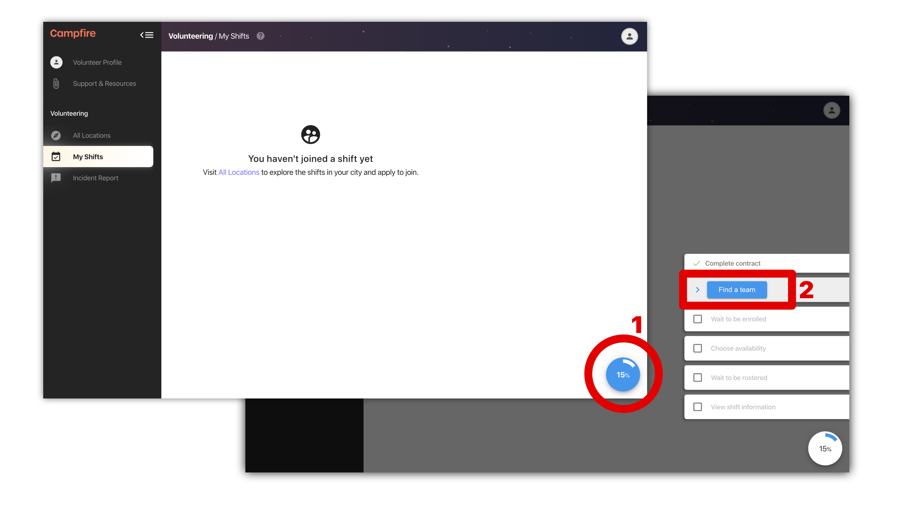

# Applying for a team

The first step to volunteering on Campfire is to find a team. Teams are groups of volunteers that are attached to a regular service. You can browse all of the services that your organisation runs by visiting the `All Locations` page. In this article we'll walk you through the important steps in joining a team, and highlight the `All Locations` page.

## What you'll see first

Once your contract has been verified, you'll have access to your full volunteering account. The first thing you'll see is the My Shifts page. You might also be greeted with an onboarding checklist `[1]`.

You can open the onboarding checklist at any time, and click on the active step - which will be marked with a blue button `[2]` - to be taken to the right place.

Click on the `Find a team` step, or navigate to the `All Locations` page. If you are on a mobile device, the navigation menu can be opened using the menu button in the top-left corner of the screen.

## Finding a team using All Locations

The All Locations page provides a complete overview of the services within your organisation. Each of these locations will have a list of regular shifts (or once-off shifts if your org is running events).

Open a location by clicking a pin on the map `[1]` or by selecting it from the locations list `[2]`.

Once you have a location selected you will see the details open underneath. From here you can apply to join any team by hitting the `Apply for team` button `[3]`.

When you apply for a team you are simply expressing your interest in joining the team that runs that particular shift. You should chose teams from shifts that are in a time and place that makes regular volunteering easy for you.

While you are waiting for a manager view your team application, you can manage all pending enrollments through your `My Shifts` page.

As soon as a manager enrolls you in a team we'll send you an email. After that you'll be able to kick off your rosters and apply to get out on an upcoming shift.
